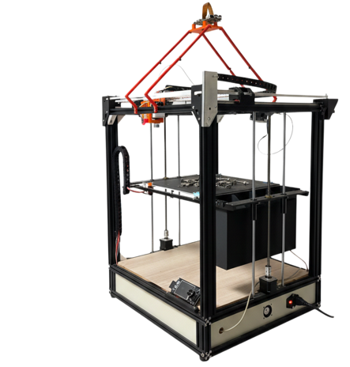

# PI01 TriAkSys

This project consists of transforming a 3D printer into an automated sorting machine capable of identifying and sorting hardware components such as screws, washers, nuts etc...

# Materials
- 3D Printer: Tronxy X5
- Raspberry Pi 5 with camera module
- Toothbrush used as a guiding mechanism

# Classification
- Dataset: We use a dataset containing approximately 800 images of hardware components (screws, washers, nuts, etc.).
- Feature Extraction: We use DINOv2 to extract high-level visual embeddings from each image. These embeddings capture shape, texture, and structural information.
- Dimensionality Reduction: We apply Principal Component Analysis (PCA) and retain 50 principal components in order to reduce noise and redundancy while preserving most of the variance.
- Clustering Algorithm: We use K-means to cluster the hardware pieces based on their feature representation 

 
